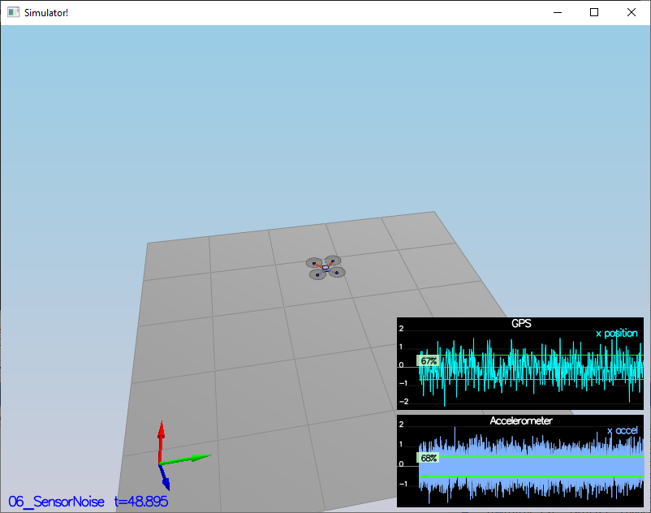
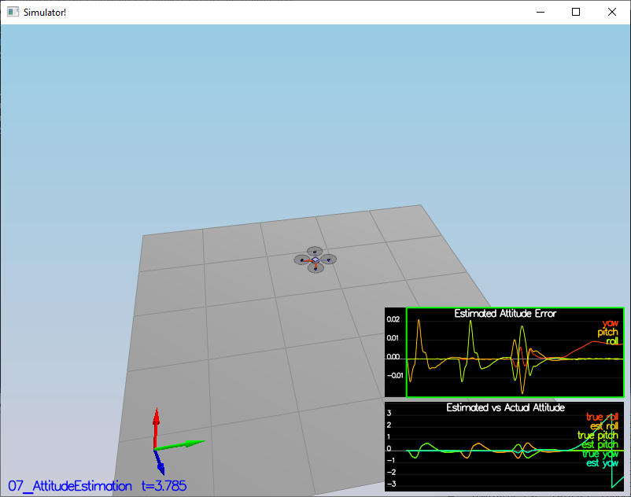
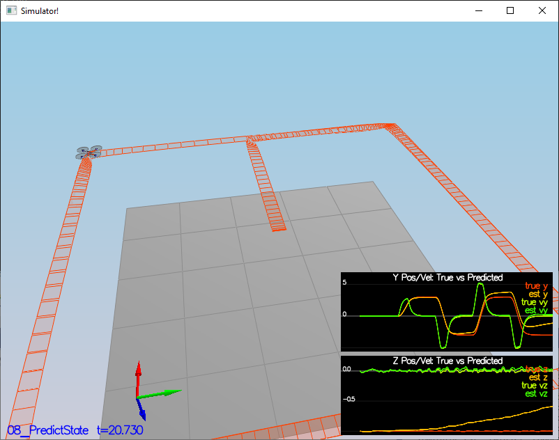
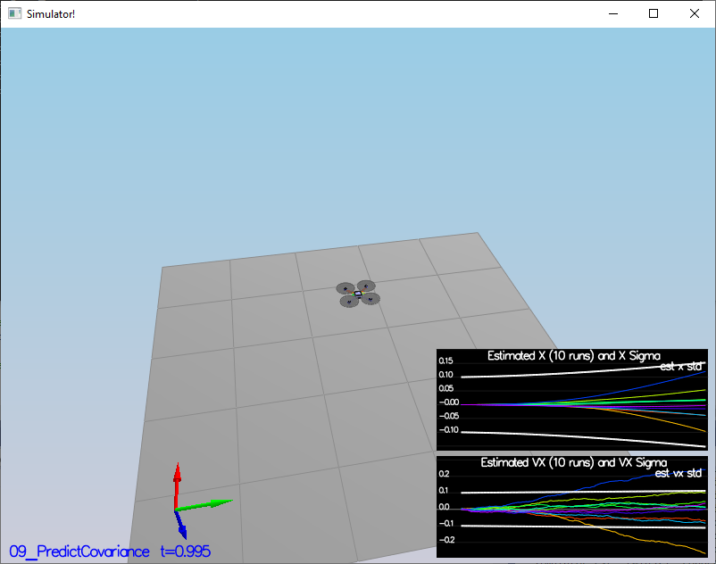
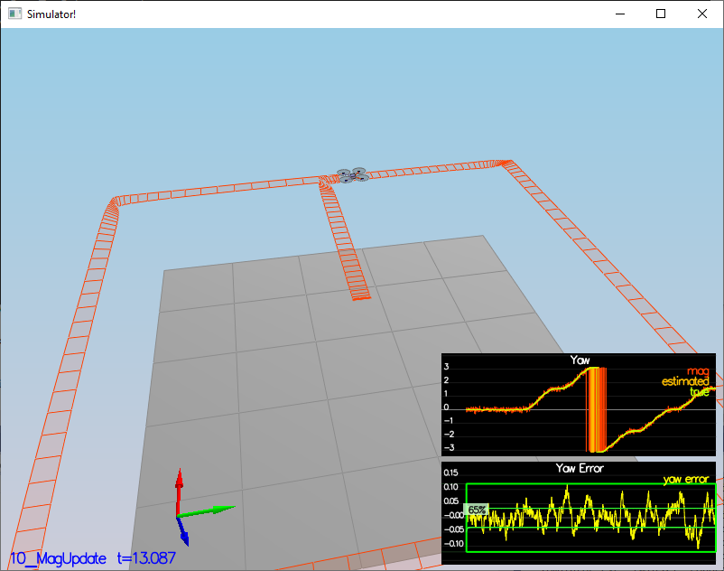

## The Tasks ##

Once again, you will be building up your estimator in pieces.  At each step, there will be a set of success criteria that will be displayed both in the plots and in the terminal output to help you along the way.

Project outline:

 - [Step 1: Sensor Noise](#step-1-sensor-noise)
 - [Step 2: Attitude Estimation](#step-2-attitude-estimation)
 - [Step 3: Prediction Step](#step-3-prediction-step)
 - [Step 4: Magnetometer Update](#step-4-magnetometer-update)
 - [Step 5: Closed Loop + GPS Update](#step-5-closed-loop--gps-update)
 - [Step 6: Adding Your Controller](#step-6-adding-your-controller)


### Step 1: Sensor Noise ###

In this first step, I  collect some simulated noisy sensor data and estimate the standard deviation of the quad's sensor.

I had to increase the time to 50 seconds to collect more data and used a small python script to determine the standard deviation:

```python
from statistics import mean, stdev
f = open("config/log/Graph1.txt", 'r')

# Remove the first line 
f.readline()

# Create the list of values 
values = []
for line in f.readlines():
  # After splitting the line, take the last element, remove extra spaces and cast it to int.
  value = float(line.split(',')[-1].strip())
  # Add the value to the salaries list.
  values.append(value)
# min and max return the minimum and the maximum value of the list.
print(min(values), max(values))   
print(mean(values), stdev(values))
f.close()

My calculations are below

```

`MeasuredStdDev_GPSPosXY = 0.6700750371714136`
`MeasuredStdDev_AccelX = 0.49677320563152644`

***Success criteria:*** *Your standard deviations should accurately capture the value of approximately 68% of the respective measurements.*

Updating the config fiel with the calculated values allowed all tests to pass meeting success criteria.



```
Simulation #1 (../config/06_SensorNoise.txt)
Simulation #2 (../config/06_SensorNoise.txt)
PASS: ABS(Quad.GPS.X-Quad.Pos.X) was less than MeasuredStdDev_GPSPosXY for 67% of the time
PASS: ABS(Quad.IMU.AX-0.000000) was less than MeasuredStdDev_AccelXY for 68% of the time
```


### Step 2: Attitude Estimation ###

I implement the first step to the state estimation: including information from our IMU.  In this step, I implemented a small-angle approximation integration method in the function UpdateFromIMU(). Started by getting the quaternion form the Euler Roll/Pitch/Yaw RPY.  Applied the IntegratedBodyRate() to get teh q_t (Nonlinear Complementary Filter). Then extracted roll, pitch and yaw from q_t, with finally normalizing the yaw. Code implemented below.

```java
  Quaternion<float> qt = Quaternion<float>::FromEuler123_RPY(rollEst, pitchEst, ekfState(6)); // RPY to quaternion
  Quaternion<float> q_t = qt.IntegrateBodyRate(gyro, dtIMU); // q_t = qt * dq
  float predictedPitch = q_t.Pitch(); // extracted RPY from the quaternion.
  float predictedRoll = q_t.Roll();
  ekfState(6) = q_t.Yaw();

  // normalize yaw to -pi .. pi
  if (ekfState(6) > F_PI) ekfState(6) -= 2.f*F_PI;
  if (ekfState(6) < -F_PI) ekfState(6) += 2.f*F_PI;
```

***Success criteria:*** *Your attitude estimator needs to get within 0.1 rad for each of the Euler angles for at least 3 seconds.*

With the implemented small-angle approximation integration, all tests meet the success criteria and pass.



```
Simulation #1 (../config/07_AttitudeEstimation.txt)
Simulation #2 (../config/07_AttitudeEstimation.txt)
PASS: ABS(Quad.Est.E.MaxEuler) was less than 0.100000 for at least 3.000000 seconds
Simulation #3 (../config/07_AttitudeEstimation.txt)
PASS: ABS(Quad.Est.E.MaxEuler) was less than 0.100000 for at least 3.000000 seconds
```


### Step 3: Prediction Step ###

In this step I am implementing the prediction step of my filter.

In `QuadEstimatorEKF.cpp`, I implement the state prediction step  with the following algorithm which allows our estimator state to track the actual state with a slow drift.

```java
  V3F accel_g = attitude.Rotate_BtoI(accel);

  predictedState(0) += curState(3) * dt;
  predictedState(1) += curState(4) * dt;
  predictedState(2) += curState(5) * dt;
  predictedState(3) += accel_g.x * dt;
  predictedState(4) += accel_g.y * dt;
  predictedState(5) += (accel_g.z - CONST_GRAVITY) * dt;
```




Example of Good Covariance for comparison


Using Section 7.2 of the Estimation for Quadrotors, I implemented GetRbgPrime() and Predict() functions which produce an acceptable covariance prediction.

GetRbgPrime()

```java
  RbgPrime(0, 0) = -cos(roll) * sin(yaw);
  RbgPrime(1, 0) = sin(roll) * sin(yaw);

  RbgPrime(0, 1) = -(sin(pitch) * sin(roll) * sin(yaw)) - (cos(pitch) * cos(yaw));
  RbgPrime(1, 1) = (sin(pitch) * sin(roll) * cos(yaw)) - (cos(pitch) * sin(yaw));

  RbgPrime(0, 2) = -(cos(pitch) * sin(roll) * sin(yaw)) + (sin(pitch) * cos(yaw));
  RbgPrime(1, 2) = (cos(pitch) * sin(roll) * cos(yaw)) + (sin(pitch) * sin(yaw));
```

Predict()
```java
  gPrime.block<3, 3>(0, 3) = Eigen::Matrix3f().setIdentity() * dt;

  Eigen::Vector3f accelVector(accel[0], accel[1], accel[2]);
  gPrime.block<3, 1>(3, 6) = Eigen::Array3f(dt);
  gPrime(3, 6) *= accelVector.dot(RbgPrime.row(0));
  gPrime(4, 6) *= accelVector.dot(RbgPrime.row(1));
  gPrime(5, 6) *= accelVector.dot(RbgPrime.row(2));

  ekfCov = gPrime * ekfCov * gPrime.transpose() + Q;

```



***Success criteria:*** *This step doesn't have any specific measurable criteria being checked.*


### Step 4: Magnetometer Update ###

In this step we add the magnetometer to improve the filter performance in estimating the vehicle's heading.

I start by tuning the parameter `QYawStd` (`QuadEstimatorEKF.txt`) for the QuadEstimatorEKF so that it approximately captures the magnitude of the drift, which resulted in a tune parameter of .115

***Success criteria:*** *Your goal is to both have an estimated standard deviation that accurately captures the error and maintain an error of less than 0.1rad in heading for at least 10 seconds of the simulation.*

Implementing the UpdateFromMag() function to take the current estimated yaw and calculate the difference between measured and estimated yaw.  Running the scenario passes all criteria.

```java
 zFromX(0) = ekfState(6);
  float yawDiff = z(0) - zFromX(0);

  if (fabs(yawDiff) > F_PI) {
      zFromX(0) += (2.0f * F_PI) * ((yawDiff > F_PI) ? 1 : -1);
  }

  hPrime(6) = 1;
```



```
Simulation #1 (../config/10_MagUpdate.txt)
Simulation #2 (../config/10_MagUpdate.txt)
PASS: ABS(Quad.Est.E.Yaw) was less than 0.120000 for at least 10.000000 seconds
PASS: ABS(Quad.Est.E.Yaw-0.000000) was less than Quad.Est.S.Yaw for 68% of the time
```
### Step 5: Closed Loop + GPS Update ###

1. Run scenario `11_GPSUpdate`.  At the moment this scenario is using both an ideal estimator and and ideal IMU.  Even with these ideal elements, watch the position and velocity errors (bottom right). As you see they are drifting away, since GPS update is not yet implemented.

2. Let's change to using your estimator by setting `Quad.UseIdealEstimator` to 0 in `config/11_GPSUpdate.txt`.  Rerun the scenario to get an idea of how well your estimator work with an ideal IMU.

3. Now repeat with realistic IMU by commenting out these lines in `config/11_GPSUpdate.txt`:
```
#SimIMU.AccelStd = 0,0,0
#SimIMU.GyroStd = 0,0,0
```

4. Tune the process noise model in `QuadEstimatorEKF.txt` to try to approximately capture the error you see with the estimated uncertainty (standard deviation) of the filter.

5. Implement the EKF GPS Update in the function `UpdateFromGPS()`.

6. Now once again re-run the simulation.  Your objective is to complete the entire simulation cycle with estimated position error of < 1m (you’ll see a green box over the bottom graph if you succeed).  You may want to try experimenting with the GPS update parameters to try and get better performance.

***Success criteria:*** *Your objective is to complete the entire simulation cycle with estimated position error of < 1m.*

**Hint: see section 7.3.1 of [Estimation for Quadrotors](https://www.overleaf.com/read/vymfngphcccj) for a refresher on the GPS update.**

At this point, congratulations on having a working estimator!

### Step 6: Adding Your Controller ###

Up to this point, we have been working with a controller that has been relaxed to work with an estimated state instead of a real state.  So now, you will see how well your controller performs and de-tune your controller accordingly.

1. Replace `QuadController.cpp` with the controller you wrote in the last project.

2. Replace `QuadControlParams.txt` with the control parameters you came up with in the last project.

3. Run scenario `11_GPSUpdate`. If your controller crashes immediately do not panic. Flying from an estimated state (even with ideal sensors) is very different from flying with ideal pose. You may need to de-tune your controller. Decrease the position and velocity gains (we’ve seen about 30% detuning being effective) to stabilize it.  Your goal is to once again complete the entire simulation cycle with an estimated position error of < 1m.

**Hint: you may find it easiest to do your de-tuning as a 2 step process by reverting to ideal sensors and de-tuning under those conditions first.**

***Success criteria:*** *Your objective is to complete the entire simulation cycle with estimated position error of < 1m.*


## Tips and Tricks ##

 - When it comes to transposing matrices, `.transposeInPlace()` is the function you want to use to transpose a matrix

 - The [Estimation for Quadrotors](https://www.overleaf.com/read/vymfngphcccj) document contains a helpful mathematical breakdown of the core elements on your estimator

## Submission ##

For this project, you will need to submit:

 - a completed estimator that meets the performance criteria for each of the steps by submitting:
   - `QuadEstimatorEKF.cpp`
   - `config/QuadEstimatorEKF.txt`

 - a re-tuned controller that, in conjunction with your tuned estimator, is capable of meeting the criteria laid out in Step 6 by submitting:
   - `QuadController.cpp`
   - `config/QuadControlParams.txt`

 - a write up addressing all the points of the rubric

## Authors ##

Thanks to Fotokite for the initial development of the project code and simulator.